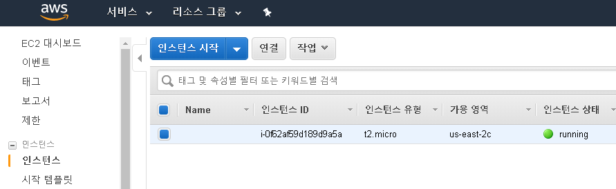
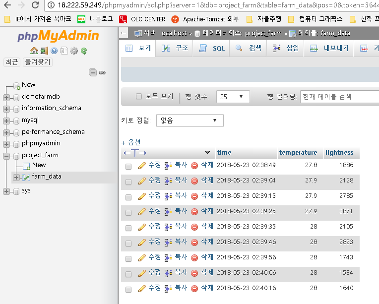
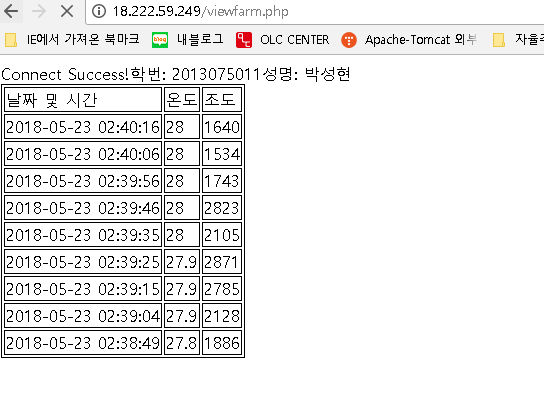
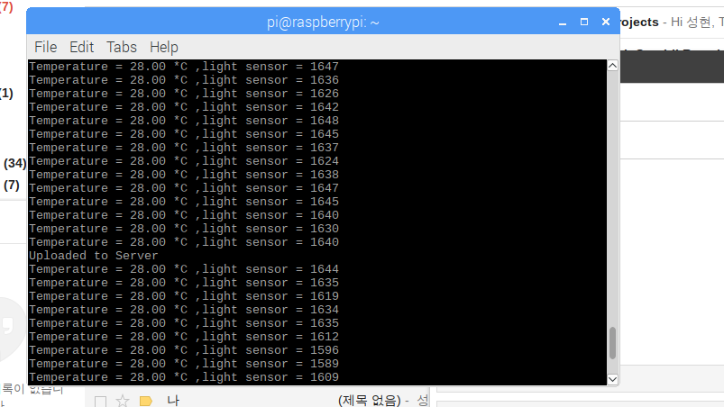

유튜브 영상 URL : https://youtu.be/S_kiA7OCok0

## 스마트팜 최종 프로젝트
### 학번 : 2013075011
### 이름 : 박성현

#### 요구사항 :
#####  1) 1밀리초마다 온도와 조도를 모니터링 하라
#####  2) 조도값을 측정할 땐 아날로그 입력을 이용하라
#####  3) 서버를 만들고, MySQL과 Apache를 설치하라
#####  4) 10초마다 서버로 센서데이터를 보내라
#####  5) 20도가 넘어가면 5초 동안 선풍기를 틀어라
#####  6) 특정 조도를 넘기면 LED가 작동하도록 하라
#####  7) 각 기능들이 독립적으로 작동하도록 하라(4개의 쓰레드를 사용하라)
#####  8) 쓰레드끼리 시그널을 통해 통신하도록 하라
#####  9) 1분 이상 데이터를 수집하라
#####  10) 웹 서버의 데이터 모습을 캡쳐하라(이 화면이 GIT과 최종보고서에 포함되어야한다)

#### 설계 :
#####  1) 1밀리초마다 온도와 조도를 모니터링 하라
    nanosleep으로 나노단위로 초를 조작한다. 1ms = 1000ns
    생산자 쓰레드에서 온도와 조도를 각각 공유변수에 저장하고 출력하도록 한다

#####  2) 조도값을 측정할 땐 아날로그 입력을 이용하라
    조도센서의 아날로그 단자로 꼽아주면 된다.

#####  3) 서버를 만들고, MySQL과 Apache를 설치하라
    서버는 AWS를 사용하고, 우분투 16.04에 mysql과 apache를 설치했다.

#####  4) 10초마다 서버로 센서데이터를 보내라
    소비자 쓰레드를 이용한다
    nanosleep에서 10초로 설정하고 쿼리를 작성하여 서버의 데이터베이스로 전송한다.

#####  5) 20도가 넘어가면 5초 동안 선풍기를 틀어라
    IF(20도 이상일 경우)
    digitalWrite(FAN, 1)
    5초 동안 sleep
    digitalWrite(FAN, 0)
    1초 동안 sleep
    의 알고리즘 형태로 작성한다. 1초의 텀을 둔 이유는 현재 온도가 일반적으로 20도 이상이기 때문이다.
    그래서 계속 FAN이 작동하므로 5초동안 작동하고 꺼지는 모습을 보이기 위해서 1초간의 텀을 둔 것이다.

#####  6) 특정 조도를 넘기면 LED가 작동하도록 하라
    조도 센서가 일반적으로 2000정도의 값을 보통 밝기로 인식하고 4000정도를 최대 어두운 정도로 인식한다.
    따라서, IF(조도 > 3500)
            digitalWrite(LED, 1)
          digitalWrite(LED, 0) 형태로 작성한다

#####  7) 각 기능들이 독립적으로 작동하도록 하라(4개의 쓰레드를 사용하라)
    POSIX 생산자 소비자 쓰레드를 참고해서 작성한다.

#####  8) 쓰레드끼리 시그널을 통해 통신하도록 하라
    mutex와 condition변수를 이용하고 wait과 signal을 통해 통신한다.

#####  9) 1분 이상 데이터를 수집하라
    for문으로 loops를 쓰지않고, while(1)을 이용하면, 무한 루프이므로 이 부분을 해결한다.

#####  10) 웹 서버의 데이터 모습을 캡쳐하라(이 화면이 GIT과 최종보고서에 포함되어야한다)
    화면 참고자료 마지막 파일

#### 고찰
타이머 인터럽트를 이용해서, 10초마다 서버로 보내고, 5초 동안만 키고 끄도록 하려고 조사한 결과, timer와 관련된 리눅스의 함수가 있었다.
timer_create와 set_itimer같은 함수들을 통해 타이머를 생성하고, 실행할 수 있었으나, 동적으로 생성되었다가, 타이머를 종료할 수가 없었다.
따라서, nanosleep을 이용해서 쓰레드 자체가 시간을 재도록 만들었다. sleep이나 delay보다는 REAL_TIME에 더 충실하다고 생각한다. 쓰레드의
스케쥴링에 대해서도 환형큐의 MAX값을 조작해보며 어느정도의 버퍼크기가 적당한지 테스트해보았다.

#### 참고 자료
#### 아마존 웹 서버(AWS)에서 인스턴스를 생성한 화면

#### phpmyadmin에서 데이터베이스를 확인한 화면

#### 서버 내의 php파일에서 데이터 통계를 확인하는 화면

#### 1ms마다 생산자가 값을 저장하고, 모니터링하는 모습(중간에 서버 전송하면 문구를 출력)

