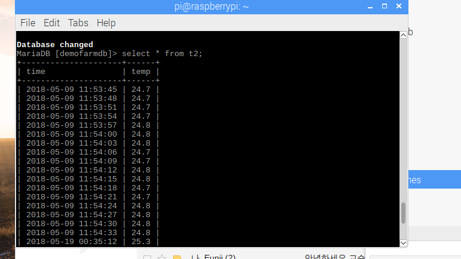

## [쓰레드 프로그래밍 프로젝트]
### 학번 : 2013075011
### 이름 : 박성현

### 요구사항 :
#### 1) 생산자는 온도 값을 3초마다 측정한다
#### 2) 생산자는 측정한 온도값을 공유버퍼에 저장한다.
#### 3) 생산자는 시그널링을 통해 소비자를 깨운다.
#### 4) 소비자는 데이터베이스로 온도값을 저장한다.

### 설계사항:
  생산 소비자 쓰레드 형태로 쓰레드를 구성한다.
  생산자는 3초동안 sleep한다

  소비자는 쿼리를 통해 값을 저장한다.

### 고찰 :
  교수님께서 주신 참고자료의 생산 소비자 코드를 참고하고, 교재의 mysql사용 코드를 참고했습니다.
  온도센서관련 코드는 기존 프로젝트의 코드를 사용했습니다. 공유변수에서 값을 꺼내가는 순서가 따로 정해져 있지 않습니다.
  따라서 누가 먼저 공유 버퍼의 값을 취할 지 정하기 위해서는 일종의 스케쥴링 기법을 적용해야 한다고 생각합니다.
  교수님께서 IF 대신 WHILE문을 사용해야 생산자가 일을 마쳤을 때, 다른 쓰레드가 값을 가로채지 않는다는 강의가 생각났습니다.

### 참고 자료
#### 데이터 베이스에 값이 저장된 화면
  
#### 생산자와 소비자가 값을 공유변수에 넣고 가져가는 화면
    
